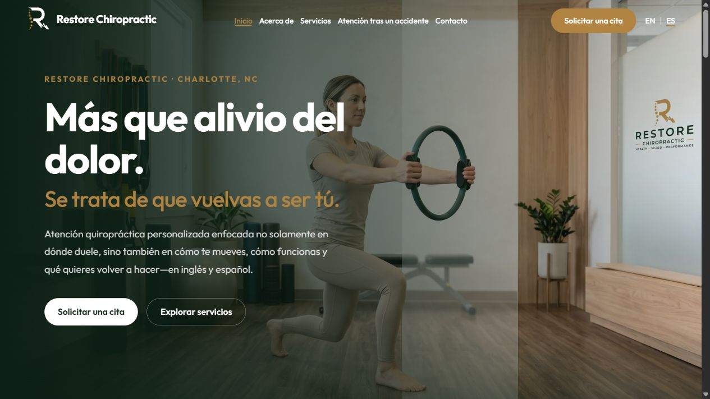
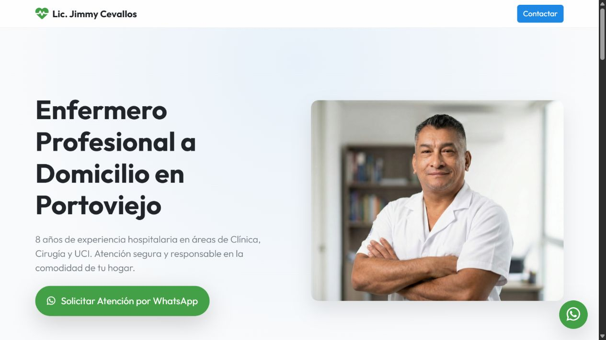
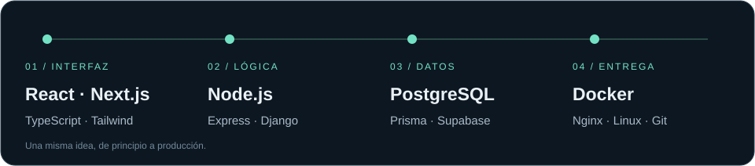
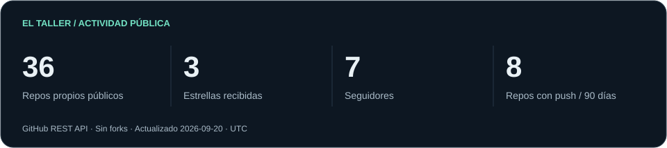
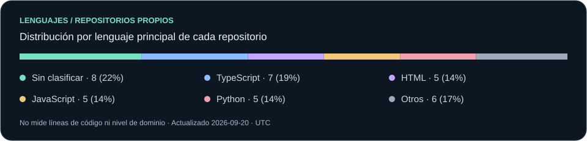
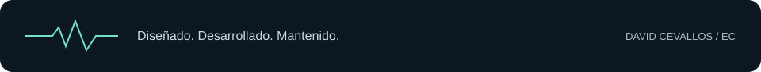

  <a href="https://davidcevallos.vercel.app"><strong>Portafolio ↗</strong></a> &nbsp; / &nbsp;
  <a href="https://www.linkedin.com/in/jimmy-david-cevallos-zambrano-859876191">LinkedIn</a> &nbsp; / &nbsp;
  <a href="https://youtube.com/@JimmyCevaZam">YouTube</a> &nbsp; / &nbsp;
  <a href="https://github.com/DavidCevallos15?tab=repositories">Repositorios</a>

## Desarrollo web con los pies en el mundo real.

Soy **David Cevallos**, desarrollador full-stack en Ecuador. Construyo sitios y sistemas web para profesionales, instituciones de salud y estudiantes: desde la interfaz que ve una persona hasta la API y el panel que utiliza su equipo.

Mi primer proyecto fue una web para el **Lic. Jimmy Cevallos**, enfermero a domicilio en Portoviejo. Hoy, ese recorrido incluye un sistema institucional para un hospital y **Restore Chiropractic**, mi proyecto más reciente para un cliente en Estados Unidos.

**Mi enfoque:** interfaces claras · arquitectura mantenible · seguridad desde el diseño.

- **Formación:** Ingeniería en Tecnologías de la Información en la Universidad Técnica de Manabí.
- **Trabajo:** desarrollo full-stack freelance, despliegue, soporte y mantenimiento.
- **Exploración:** IA generativa aplicada al desarrollo, con revisión y validación de los resultados.
- **Comparto:** arquitectura, desarrollo web, DevSecOps e IA aplicada en YouTube.

## 01 / Proyecto más reciente

### Restore Chiropractic

**Charlotte, Estados Unidos · Cliente internacional · Web publicada**

Una presencia digital para un consultorio quiropráctico, pensada para que sus pacientes puedan **conocer los servicios, elegir su idioma y acceder a la solicitud de una cita**.

| Lo que resuelve | Cómo está planteado |
| :--- | :--- |
| Explicar la atención del consultorio | Páginas de servicios, presentación del profesional y preguntas frecuentes. |
| Atender a públicos distintos | Navegación y contenido en **inglés y español**. |
| Facilitar el siguiente paso | Accesos al sistema externo de citas y a los datos de contacto. |
| Mantener una presencia profesional | Diseño adaptable, metadatos y datos estructurados del negocio. |

`Next.js` `React` `Tailwind CSS` `i18n` `SEO técnico`

**[Visitar Restore Chiropractic ↗](https://www.restorechiropracticcare.com/)**

## 02 / Donde empezó todo

### Lic. Jimmy Cevallos · Enfermería a domicilio

**Portoviejo, Ecuador · Mi primer proyecto web**

Un sitio para presentar servicios de enfermería a domicilio y facilitar el contacto por WhatsApp. El punto de partida de mi trabajo para profesionales de la salud: **organizar la información, transmitir confianza y hacer sencillo pedir atención**.

`JavaScript` `Bootstrap` `Vite` `Vercel`

**[Visitar el sitio ↗](https://enfermero-jimmy-cevallos.vercel.app/)** · [Explorar el código](https://github.com/DavidCevallos15/enfermero-jimmy-cevallos)

## 03 / Más allá de una landing

### HPVC · Sistema web institucional

Proyecto de titulación para el **Hospital Provincial General Dr. Verdi Cevallos Balda**: portal institucional, panel administrativo/CMS y API REST en una arquitectura desacoplada, desplegada en infraestructura del hospital.

`React` `Node.js` `Express` `PostgreSQL` `Prisma` `Docker` `Nginx`

<strong>Ver decisiones de arquitectura y seguridad</strong>

- **Separación de responsabilidades:** portal público, administración y API en un monorepo.
- **Autenticación y permisos:** JWT en cookies `HttpOnly` y control de acceso por roles.
- **Validación y protección:** esquemas con Zod y cabeceras HTTP mediante Helmet.
- **Entrega:** contenedores Docker y Nginx en la infraestructura institucional.
- **Evaluación:** verificación documental de 12 casos de uso críticos y trazabilidad de requisitos.

[Sitio institucional ↗](https://hpvc.gob.ec) · [Caso de estudio en mi portafolio](https://davidcevallos.vercel.app)

### Inforario · Herramientas para estudiantes de la UTM

Un proyecto que parte de una necesidad cercana: **organizar los horarios universitarios**. Incluye una aplicación web y una extensión de navegador que transforma PDFs del SGU en horarios interactivos e integra Google Calendar.

`React` `TypeScript` `Supabase` `Vite` `Manifest V3`

[Código de la app ↗](https://github.com/DavidCevallos15/Inforario-v2.0) · [Extensión de navegador](https://github.com/DavidCevallos15/inforario-extension)

## 04 / Herramientas con propósito

| Área | En qué las aplico |
| :--- | :--- |
| **Frontend** | Interfaces adaptables y componentes reutilizables con React, Next.js, TypeScript y Tailwind CSS. |
| **Backend y datos** | APIs, autenticación y modelado de datos con Node.js, Express, Python, Django, PostgreSQL, Prisma y Supabase. |
| **Entrega y seguridad** | Docker, Nginx, Git, Linux, validación de entradas y permisos por rol. |
| **Entorno personal** | Fedora Workstation, ThinkPad, Cursor, Windsurf y APIs de IA. |

## 05 / Lo que estoy construyendo

Datos públicos de GitHub · Se excluyen forks · Las tarjetas muestran su fecha de actualización.

---

### ¿Tienes un proyecto que necesita pasar de idea a web?

Me interesa construir productos que las personas puedan entender, usar y mantener.

**[Conversemos en LinkedIn ↗](https://www.linkedin.com/in/jimmy-david-cevallos-zambrano-859876191)** · [Conoce mi trabajo](https://davidcevallos.vercel.app) · [Mira lo que comparto](https://youtube.com/@JimmyCevaZam)

